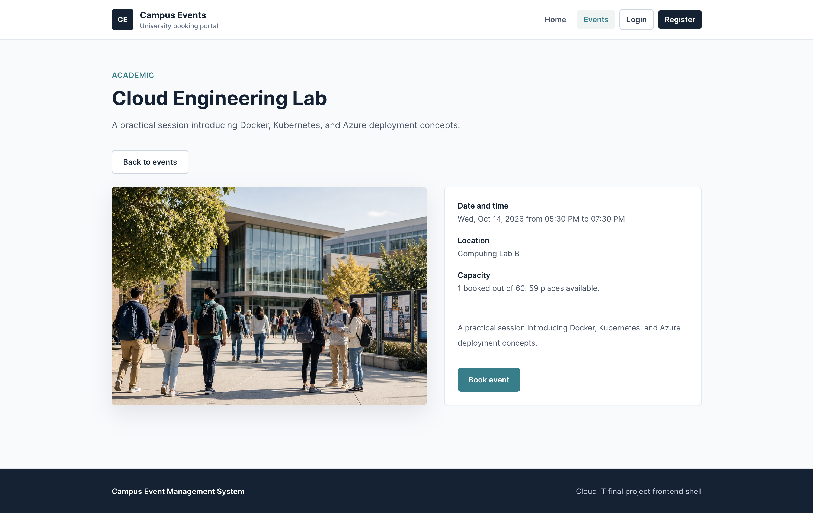
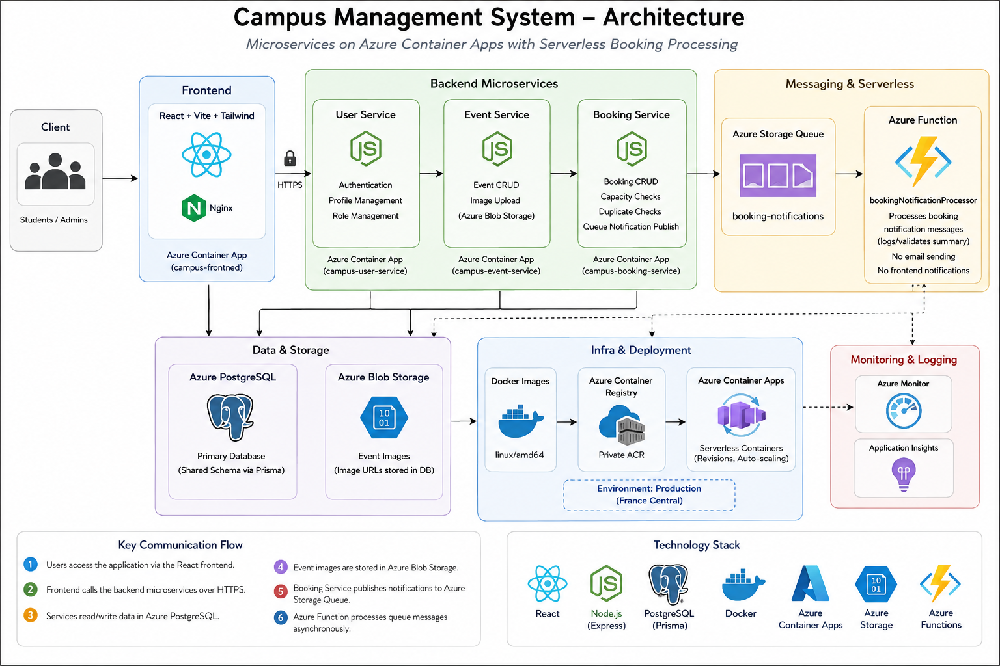

# Campus Management System

A full-stack project for browsing, managing, and booking campus events.



## Project Overview

The Campus Management System lets students discover campus activities, register or log in, book events, cancel bookings, view cancelled booking history, book again from a cancelled booking, and manage their profile.

Administrators have a role-specific homepage, an Admin Dashboard, and tools to create, edit, delete, and manage events. Admin views also provide operational event and booking information.

## Live Demo

The deployed application is available here: [Open Campus Management System](https://campus-frontend.icyglacier-9ccad18f.francecentral.azurecontainerapps.io)

Demo seed users:

```text
admin@campus.test / DevPassword123!
student@campus.test / DevPassword123!
```

## Key Features

- Public home page, event browsing, search, filtering, and event details.
- Student authentication with JWT-based protected routes.
- Student booking, cancellation, cancelled-booking history, and book-again flow.
- Profile loading and editing.
- Admin homepage, Admin Dashboard, and event management forms.
- Event image upload through Azure Blob Storage.
- PostgreSQL persistence through Prisma.
- Queue-triggered Azure Function for asynchronous booking notification processing.
- Local Docker Compose stack and Azure Container Apps deployment workflow.

## Architecture


##### (Image is generated by ChatGPT)

The frontend uses same-origin `/api/...` requests in Azure. Its nginx container proxies those requests to internal Container Apps for the backend services. Backend services are not exposed publicly.

## Azure / Cloud Deployment

The production application is deployed on Azure using Azure Container Apps, with Docker images stored in Azure Container Registry. Azure Database for PostgreSQL provides persistent storage, Azure Blob Storage stores event images, and Azure Storage Queue together with Azure Functions provides asynchronous booking processing.

See [Azure Container Apps Deployment](docs/AZURE-CONTAINER-APPS-DEPLOYMENT.md) for the complete deployment architecture and instructions.

## Container Orchestration

Azure Container Apps is the final production orchestration solution. Kubernetes/AKS was originally prepared, but Azure for Students quota limitations prevented a practical AKS deployment. The Kubernetes manifests remain in the repository as an alternative orchestration artifact.

See [Kubernetes / AKS Preparation](docs/kubernetes.md) for details.

## Serverless Booking Processing

Booking notifications are processed asynchronously using Azure Storage Queue and Azure Functions:

`Booking Service → Azure Storage Queue → bookingNotificationProcessor`

After a booking is persisted, the Booking Service publishes a notification message to the `booking-notifications` queue. The queue-triggered Azure Function then processes the message independently of the booking request.

For the implementation details, Azure configuration, end-to-end testing, and execution evidence, see [Serverless Booking Processing](docs/serverless-booking-processing.md).

## Technology Stack

- Frontend: React, Vite, Tailwind CSS, React Router.
- Web Server / Reverse Proxy: NGINX.
- Backend: Node.js, Express, JWT, bcryptjs.
- Database: PostgreSQL, Prisma ORM, Prisma migrations and seed data.
- Testing: Vitest, React Testing Library, service unit tests.
- Containerization: Docker, Docker Compose, Docker Buildx.
- Azure: Azure Container Registry, Azure Container Apps, Azure Database for PostgreSQL, Azure Blob Storage, Azure Storage Queue, Azure Functions.
## Testing

The project includes automated tests for the frontend, backend microservices, booking queue integration, and Azure Function processing.

Run the complete test suite:

```bash
  npm test
```

## Run Locally

Requirements:

- Node.js 20 or newer
- npm
- Docker Desktop

Setup:

```bash
  cp .env.example .env
  npm install
  docker compose up --build
```

The application is then available at:

```text
http://localhost:8080
```

## Repository Structure

```text
frontend/              React + Vite frontend
services/              Express microservices
  user-service/
  event-service/
  booking-service/
azure-function/        Queue-triggered Azure Function
prisma/                Shared Prisma schema, migrations, seed data
infra/                 Container Apps frontend nginx/Dockerfile assets
scripts/               Image build/push and Container Apps deployment scripts
docs/                  Technical notes and project journey
k8s/, kubernetes/      Optional AKS/Kubernetes preparation artifacts
```

## Engineering Journey & Reflection

The project evolved through several cloud deployment approaches. Kubernetes/AKS was originally prepared, but student subscription quota limits led to Azure Container Apps as the final orchestration solution. The complete engineering journey, challenges, architectural decisions, and reflection are documented in [Project Journey](docs/PROJECT-JOURNEY.md).

## Additional Technical Documentation

- [API Reference](docs/api.md)
- [Database Setup](docs/database.md)
- [Docker and Compose](docs/docker.md)
- [Azure Container Apps Deployment](docs/AZURE-CONTAINER-APPS-DEPLOYMENT.md)
- [Serverless Booking Processing](docs/serverless-booking-processing.md).
- [Azure Container Registry](docs/azure-container-registry.md)
- [Azure PostgreSQL](docs/azure-postgresql.md)
- [Azure Blob Storage](docs/azure-storage.md)
- [Kubernetes / AKS Preparation](docs/kubernetes.md)


## Author

Elhama Tokhi  
Cybersecurity and Business, HTW Berlin

## License

This project was developed as part of a university project at HTW Berlin.