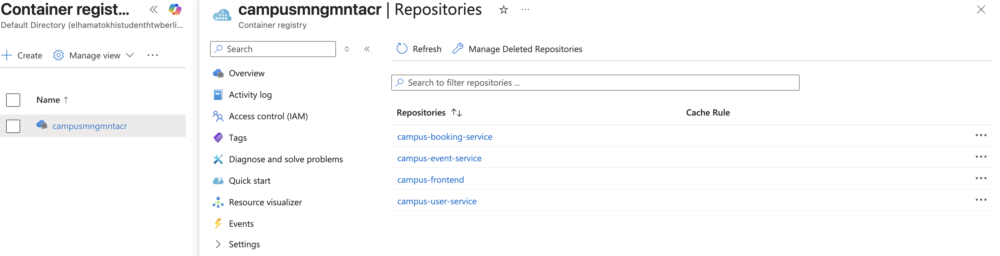

# Azure Container Registry

Azure Container Registry (ACR) is used as the private container image registry for the Campus Management System. It stores the Docker images that are deployed to Azure Container Apps.

The deployment flow is:

```text
Application Source
→ Docker Image
→ Azure Container Registry
→ Azure Container Apps
```

## Container Images

The project consists of four deployable container images:

- `campus-frontend`
- `campus-user-service`
- `campus-event-service`
- `campus-booking-service`

Each image represents an independently deployable part of the application. Images are tagged and pushed to the project's Azure Container Registry before being deployed to Azure Container Apps.
### Deployed Container Images

The Azure Container Registry contains separate repositories for the frontend and the three backend microservices.



These images are built for the Azure deployment and are pulled by Azure Container Apps using managed identity and the `AcrPull` role.

## Image Build and Push

The project provides a dedicated script for building and pushing images to ACR:

```bash
IMAGE_TAG=<unique-tag> ./scripts/build-push-aca-images.sh all
```

Individual components can also be built by using `frontend`, `user`, `event`, or `booking` instead of `all`.

Because development was performed on Apple Silicon while the Azure deployment requires compatible AMD64 images, the build workflow uses Docker Buildx to produce `linux/amd64` images before pushing them to ACR.

Image building and Azure deployment are intentionally kept as separate operations. This allows an existing image to be redeployed without rebuilding the application and makes individual services easier to update and troubleshoot.

## Integration with Azure Container Apps

Azure Container Apps retrieves the application images directly from ACR during deployment.

A user-assigned managed identity is used for this integration and is granted the `AcrPull` role on the registry. This allows Container Apps to retrieve private images without storing ACR usernames or passwords in the application configuration.

The relationship is:

```text
Azure Container Registry
        |
        | AcrPull
        v
Managed Identity
        |
        v
Azure Container Apps
```

Each Container App references the appropriate ACR image for its frontend or backend service.

## Security

The registry is used only for application images. Application secrets such as database credentials, JWT secrets, and Azure Storage connection strings are not included in the images.

ACR authentication is handled through Azure identity mechanisms, while application secrets are supplied separately through the runtime configuration of Azure Container Apps.

No registry credentials or application secrets are stored in the repository.

## Role in the Final Architecture

ACR connects the project's container build process with its production deployment:

```text
Source Code
    ↓
Docker Buildx
    ↓
linux/amd64 Images
    ↓
Azure Container Registry
    ↓
Azure Container Apps
    ↓
Running Application
```

This allows the frontend and three backend microservices to be built, versioned, stored, and deployed independently.