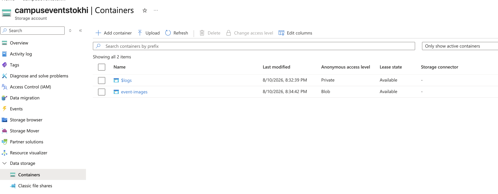

# Azure Blob Storage

Azure Blob Storage provides file storage for event images in the Campus Management System. It is integrated with the Event Service so that uploaded images are stored separately from the application's relational data.

## Role in the Project

Event images are uploaded by administrators through the Event Service and stored in an Azure Blob Storage container.

The flow is:

```text
Admin Frontend
      ↓
Event Service
      ↓
Azure Blob Storage
      ↓
Image URL
      ↓
PostgreSQL Event.imageUrl
```

The image file itself is not stored in PostgreSQL. Instead, PostgreSQL stores the URL associated with the uploaded image.

This separates binary file storage from the application's structured event data.

## Azure Deployment 

Event images uploaded through the Event Service are stored in the `event-images` Azure Blob Storage container.



The image files are stored in Blob Storage, while PostgreSQL stores the corresponding image URLs as part of the event records.
## Event Service Integration

Image uploads are handled by the admin-protected Event Service endpoint:

```text
POST /api/events/upload-image
```

The endpoint accepts `multipart/form-data` with an `image` field.

Supported image formats are:

- JPEG
- PNG
- WebP

The default maximum upload size is 5 MB.

After a successful upload, the Event Service returns the image URL, which can then be stored in the event's `imageUrl` field and displayed by the frontend.

## Configuration

The Event Service uses the following environment variables:

```text
AZURE_STORAGE_CONNECTION_STRING
AZURE_STORAGE_CONTAINER_NAME
MAX_IMAGE_UPLOAD_BYTES
```

The storage connection string is treated as a secret and is supplied through runtime configuration rather than being committed to the repository.

The container name identifies where event images are stored, while `MAX_IMAGE_UPLOAD_BYTES` controls the allowed upload size.

## Image Access

The deployed frontend needs to be able to retrieve event images from Blob Storage.

For the current project, uploaded event images can be made readable by the browser through the configured Blob Storage access model. A production system could further restrict access by using private blobs together with mechanisms such as time-limited SAS URLs.

## Failure Handling

Azure Blob Storage is an external dependency of the image-upload feature rather than a startup dependency of the entire Event Service.

If Blob Storage configuration is unavailable, the Event Service can still run and provide its other functionality. An error is returned when an image upload is attempted without the required storage configuration.

## Role in the Final Architecture

Blob Storage gives the Event Service a dedicated location for binary image data while PostgreSQL remains responsible for structured application data:

```text
Event Service
   │
   ├── Event data ─────→ PostgreSQL
   │
   └── Image files ────→ Azure Blob Storage
                              │
                              ↓
                         Image URL
                              │
                              ↓
                           Frontend
```

This keeps image storage separate from the relational database while allowing event images to remain connected to their corresponding event records.