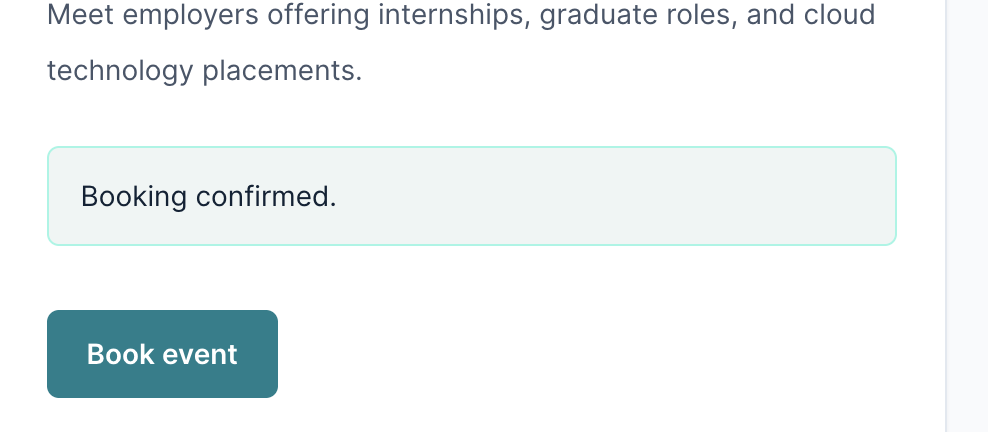
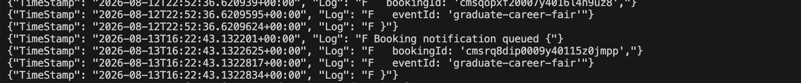
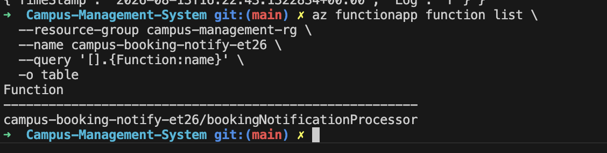
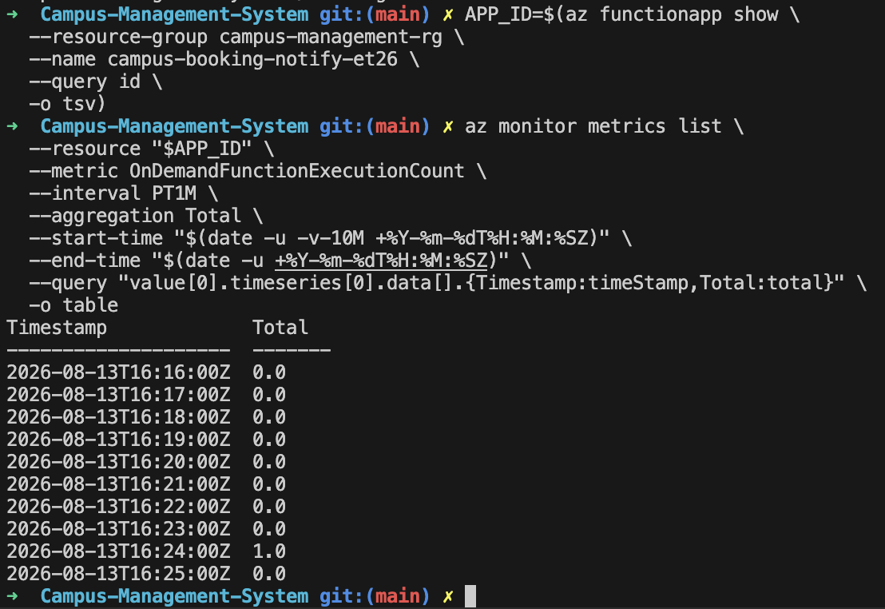

# Serverless Booking Processing

The Campus Management System uses Azure Storage Queue and Azure Functions to demonstrate asynchronous, serverless processing after a student creates a booking.

The goal is to keep booking creation independent from background notification processing.

## Architecture

```text
Student / Frontend
        ↓
Booking Service
        │
        ├──→ PostgreSQL
        │      Booking persisted
        │
        └──→ Azure Storage Queue
                    ↓
              Azure Function
        bookingNotificationProcessor
```

The Booking Service remains responsible for booking rules and persistence, while the Azure Function handles the asynchronous processing that happens after the booking has been created.

## Booking Service Integration

After a booking is successfully persisted in PostgreSQL, the Booking Service creates a notification message and publishes it to:

```text
booking-notifications
```

The message contains only the information required for notification processing, such as:

```text
bookingId
eventId
eventTitle
userEmail
userName
status
createdAt
```

Passwords, JWTs, database credentials, and Azure connection strings are never included in the queue message.

Queue publishing is intentionally separated from booking persistence. If notification publishing fails, the successfully created booking is not rolled back.

## Azure Storage Queue

Azure Storage Queue provides the communication layer between the Booking Service and Azure Function.

```text
Booking Service
      ↓
booking-notifications
      ↓
Azure Function
```

This decouples the microservice from the notification processor and allows notification processing to happen asynchronously.

Failed Function processing can be retried through Azure Functions queue-trigger behavior rather than affecting the original booking request.

## Azure Function

The queue-triggered Function is registered as:

```text
bookingNotificationProcessor
```

When a queue message arrives, the Function validates the message and processes the booking notification information.

The current implementation demonstrates serverless background processing by validating and logging notification details.

It does not currently:

- send emails
- persist notification records
- display notifications in the React frontend

These features are outside the current project scope.

## Azure End-to-End Verification

The complete serverless flow was tested using the deployed Azure application.

A real booking was created from the live frontend. The deployed Booking Service successfully persisted the booking and logged:

```text
Booking notification queued
```

The queue message was then consumed and Azure Monitor recorded corresponding executions of `bookingNotificationProcessor`.

The verified flow was therefore:

```text
Live Frontend
      ↓
Booking Service — Azure Container Apps
      ↓
Azure Storage Queue
      ↓
bookingNotificationProcessor — Azure Functions
```

During verification, two real booking queue publications were observed and corresponding Function executions appeared in Azure Monitor. No poison queue or Function exception was observed during the successful test.

## Azure Verification Evidence

The serverless workflow was verified end-to-end using a real booking created through the deployed application.

### 1. Booking Created from the Frontend



A student created a booking through the live frontend and received the `Event booked successfully` confirmation. This represents the starting point of the serverless workflow.

### 2. Booking Service Queue Publication



After the booking was persisted, the deployed Booking Service logged `Booking notification queued`, confirming that a notification message was successfully published to Azure Storage Queue.

### 3. Azure Function Discovery



Azure successfully discovered the deployed `bookingNotificationProcessor`, confirming that the queue-triggered Function was deployed and available for processing.

### 4. Function Execution



Azure Monitor recorded a Function execution after the booking notification was published, providing evidence that the queue message triggered the serverless processor.

## Testing

Automated tests cover both sides of the asynchronous workflow:

```text
Booking Service
├── queue message creation
├── queue publishing
├── successful booking behavior
└── notification failure handling

Azure Function
├── message validation
├── JSON and Buffer messages
├── malformed messages
└── processing behavior
```

These tests are included in the project's main automated test suite.

## Lesson Learned

The first queue integration exposed an Azure Storage Queue SDK issue during runtime testing. Correcting the queue client implementation reinforced the importance of testing cloud integrations both locally and in the deployed environment.

The serverless feature was also implemented primarily as a backend process. If the architecture were designed again, notification processing would be planned as an end-to-end feature from the beginning:

```text
Booking
   ↓
Queue
   ↓
Azure Function
   ↓
Persistent Notification
   ↓
Frontend Notification UI
```

This would allow the serverless processing to produce visible notifications for users while maintaining asynchronous processing.
