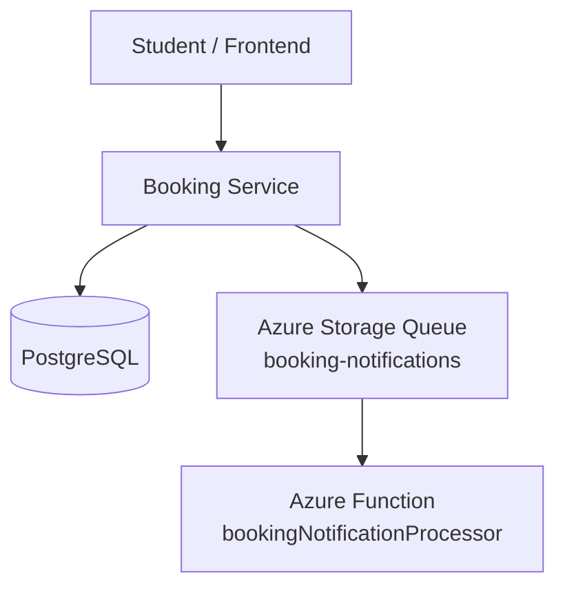

# Serverless Booking Processing

This project uses serverless, asynchronous processing for booking notifications. A student booking should be persisted quickly, and notification processing should happen separately from the user-facing booking request.

The implemented flow is:

```text
Student creates booking
-> Booking Service persists booking in PostgreSQL
-> Booking Service publishes a JSON message
-> Azure Storage Queue booking-notifications
-> Azure Function bookingNotificationProcessor
-> Function processes the notification asynchronously
```

This design keeps the Booking Service decoupled from the notification processor. The queue provides a buffer between the microservice and the Function, and a notification-processing failure does not cause an already persisted booking to fail.

## Architecture / Flow



The Booking Service owns booking persistence and business rules. The Azure Function owns asynchronous notification processing after the booking exists.

## Booking Service Integration

The Booking Service integration is implemented in:

- `services/booking-service/src/services/bookingService.js`
- `services/booking-service/src/services/bookingNotificationQueue.js`
- `services/booking-service/src/config/env.js`

In `createBookingRecord`, the service validates the request, checks event existence, rejects duplicate active bookings, rejects full events, and then creates the booking with Prisma. Notification publishing happens only after `prisma.booking.create(...)` succeeds.

The notification call is intentionally best-effort:

```js
void dependencies.publishBookingCreatedNotification(booking, dependencies.logger).catch(...)
```

Because the publish promise is handled separately, the booking response can still succeed if queue publishing fails. Failures are logged safely with the booking id, event id, and error message, but secrets are not logged.

Queue publishing is implemented with the Azure Storage Queue SDK:

```js
QueueServiceClient
  .fromConnectionString(connectionString)
  .getQueueClient(queueName)
```

The Queue client is configured from runtime environment variables. If queue configuration is missing, the service logs that notification publishing is skipped and returns without failing the booking.

## Queue Message

The Booking Service sends a JSON message with this structure:

```json
{
  "bookingId": "booking-1",
  "eventId": "event-1",
  "eventTitle": "Cybersecurity Workshop",
  "userEmail": "student@example.com",
  "userName": "Alex Student",
  "status": "CONFIRMED",
  "createdAt": "2026-08-12T15:59:00.000Z"
}
```

The payload is created from the persisted booking, including selected user and event fields. It contains only the data needed for notification processing. It does not include passwords, JWTs, database credentials, storage connection strings, or other secrets.

## Azure Storage Queue

Queue name:

```text
booking-notifications
```

The queue sits between the Booking Service and the Azure Function. The Booking Service publishes messages to the queue, and the Function is triggered when messages arrive.

The Function host configuration sets queue behavior in `azure-function/host.json`, including:

- plain text JSON queue messages with `messageEncoding: "none"`
- `maxDequeueCount: 5`
- visibility timeout and polling settings

If a message repeatedly fails processing, Azure Functions queue-trigger behavior can move it to the corresponding poison queue after the configured maximum dequeue count.

## Azure Function

The Azure Function implementation is in:

- `azure-function/src/index.js`
- `azure-function/src/functions/bookingNotificationProcessor.js`
- `azure-function/src/bookingNotificationProcessor.js`
- `azure-function/package.json`
- `azure-function/host.json`

The Function uses the Azure Functions Node.js v4 programming model. `package.json` points to:

```json
"main": "src/index.js"
```

`src/index.js` imports the queue-trigger registration module so Azure can discover the Function.

The queue trigger is registered as `bookingNotificationProcessor` and uses:

- `BOOKING_NOTIFICATION_QUEUE` for the queue name
- `AzureWebJobsStorage` for the storage account connection

When a message is received, the handler logs invocation diagnostics, calls `processBookingNotification`, logs safe failure details if processing throws, and rethrows errors so Azure Functions retry/poison-queue behavior remains intact.

The processor validates:

- required fields are present
- the message is a JSON object, JSON string, or Buffer/Uint8Array representation
- `createdAt` is a valid ISO-compatible date

It logs a safe processing summary with booking id, event id, event title, status, and created date.

Current scope:

- It processes/logs booking notification information.
- It does not send email.
- It does not persist frontend notifications.
- It does not display notifications in the React application.

## Configuration

Booking Service configuration:

```text
BOOKING_NOTIFICATION_STORAGE_CONNECTION_STRING
BOOKING_NOTIFICATION_QUEUE
```

Azure Function configuration:

```text
AzureWebJobsStorage
BOOKING_NOTIFICATION_QUEUE
```

Real connection strings and secrets are supplied through local `.env` files, Azure Container Apps secrets, or Azure Function App settings. They are not committed to Git.

Relevant examples:

- Root `.env.example`
- `services/booking-service/.env.example`
- `azure-function/local.settings.example.json`

## Local Testing

Automated Booking Service tests:

```bash
npm test -w services/booking-service
```

These tests cover:

- notification payload shape
- safe skip behavior when queue configuration is missing
- expected JSON payload passed to `sendMessage`
- notification publishing after successful booking persistence
- notification failure not failing a successful booking
- no notification when booking persistence fails

Automated Azure Function tests:

```bash
npm test -w azure-function
```

These tests cover:

- valid message validation
- JSON string queue messages
- Buffer queue message representations
- malformed JSON rejection
- missing required field rejection
- invalid `createdAt` rejection
- safe processing summary logs

For local queue-trigger testing, the Function project uses Azure Functions Core Tools and Azurite. The local settings example uses:

```text
AzureWebJobsStorage=UseDevelopmentStorage=true
BOOKING_NOTIFICATION_QUEUE=booking-notifications
```

## Azure End-To-End Verification

The Azure integration was verified with the deployed application and real Azure services.

Observed verification:

1. The Booking Service was running in Azure Container Apps.
2. A real booking was created from the deployed frontend.
3. Booking Service logs showed:

   ```text
   Booking notification queued
   ```

4. The message was sent to the Azure Storage Queue:

   ```text
   booking-notifications
   ```

5. Azure discovered the deployed Function as:

   ```text
   bookingNotificationProcessor
   ```

6. Azure Monitor showed Function executions corresponding to real bookings.

During successful verification, two real Booking Service queue publications were observed and Azure Monitor showed corresponding Function executions. The queue messages were consumed, no poison queue was created during successful testing, and no Function exception was observed.

This proves the integrated cloud path worked end to end:

```text
deployed frontend booking
-> deployed Booking Service
-> Azure Storage Queue
-> deployed Azure Function execution
```

## Azure Verification Evidence

### 1. Booking Service Queue Publication

<!-- Add screenshot: Azure Container Apps logs showing "Booking notification queued" from campus-booking-service. -->

This screenshot proves that the deployed Booking Service reached the queue publishing code after a successful booking.

### 2. Azure Function Discovery

<!-- Add screenshot: Azure Portal or Azure CLI showing bookingNotificationProcessor discovered in the Function App. -->

This screenshot proves that Azure indexed the queue-triggered Function correctly after deployment.

### 3. Function Execution Metric

<!-- Add screenshot: Azure Monitor OnDemandFunctionExecutionCount showing successful executions after real bookings. -->

This screenshot proves that the deployed Function executed in response to queue messages.

### 4. Queue / Failure Verification

<!-- Add screenshot if available: queue empty after processing, no booking-notifications-poison queue, and no Function exceptions during successful testing. -->

This screenshot proves that messages were consumed successfully and did not end up in poison-message handling during the verified run.

## Implementation Issue / Lesson

During integration, the first Booking Service queue implementation attempted to use:

```js
QueueClient.fromConnectionString(...)
```

The `@azure/storage-queue` SDK does not expose that static method on `QueueClient`. The corrected implementation uses:

```js
QueueServiceClient
  .fromConnectionString(connectionString)
  .getQueueClient(queueName)
```

This issue was caught through focused tests and runtime verification. The Booking Service also keeps notification publishing best-effort: an enqueue failure is logged without rolling back an already successful booking.

## Current Limitations

- Notification processing is currently backend/serverless only.
- There is no email delivery.
- There is no persistent Notification model/table.
- There is no notification bell or notification UI in the React frontend.

These are outside the current project scope rather than unfinished requirements.

## Conclusion

This implementation demonstrates asynchronous service integration with Azure Storage Queue and Azure Functions. The Booking Service remains focused on booking persistence and business rules, while the queue-triggered Function handles background notification processing. The flow was verified locally and through the deployed Azure application, demonstrating integration between Azure Container Apps and Azure Functions.
